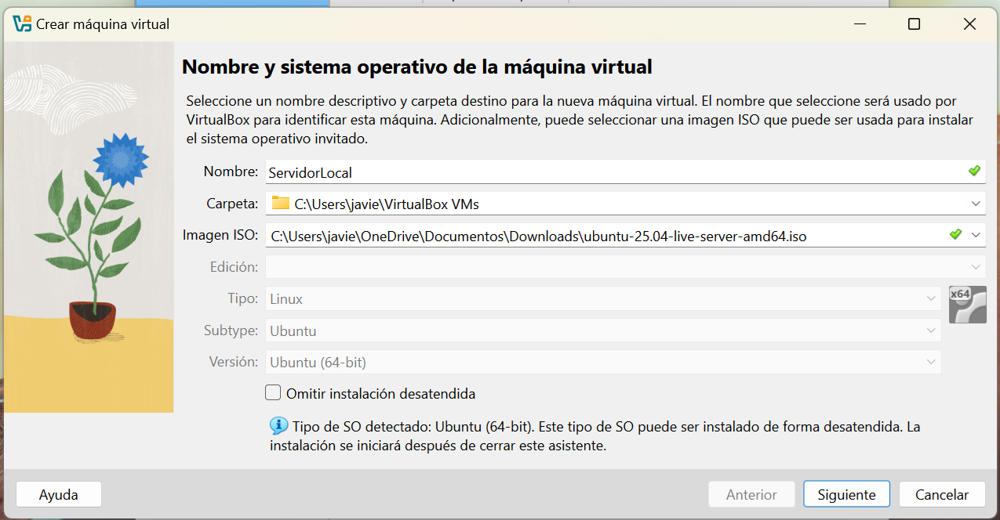
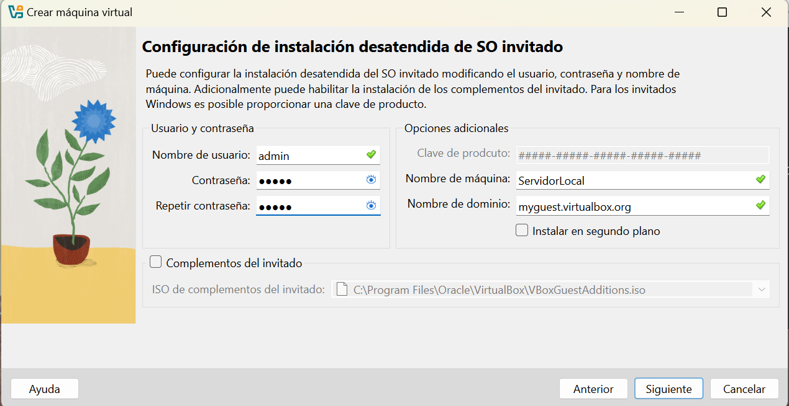
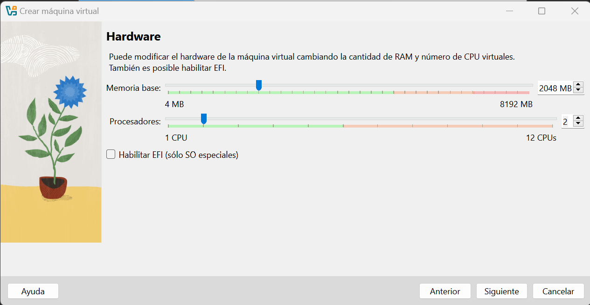
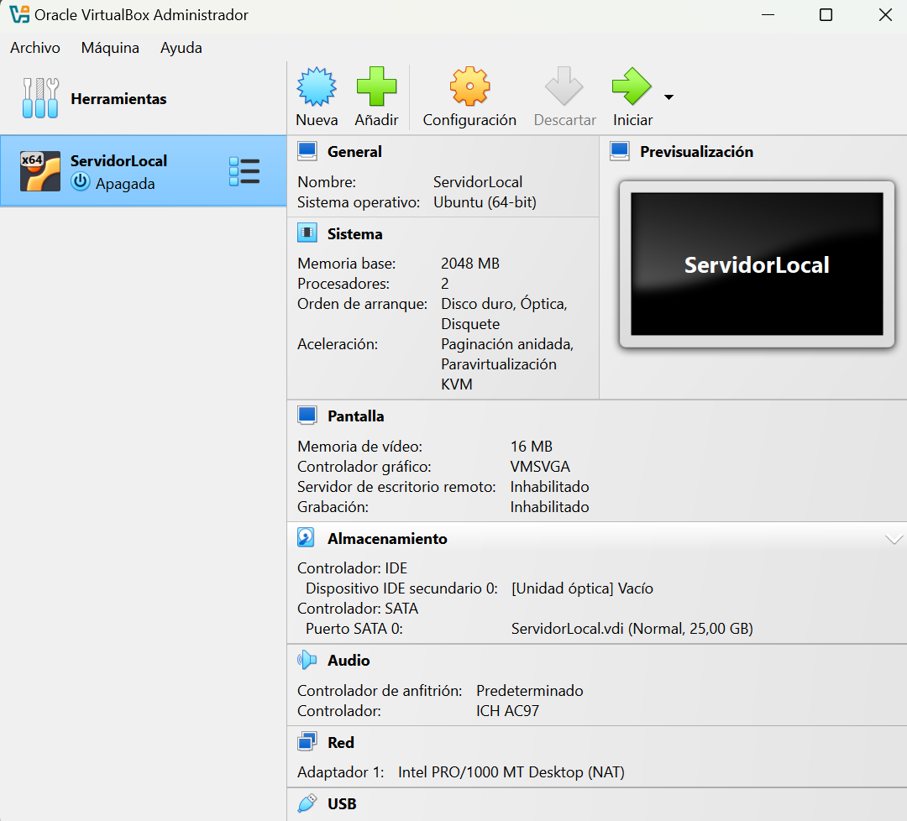

# Creación de la Máquina Virtual - VirtualBox

Fecha: 20/04/2025

## Pasos Seguidos:

1. **Creé una nueva máquina virtual** en VirtualBox.
2. **Configuré los siguientes parámetros:**
   - Nombre: `ServidorLocal`
   - Tipo: `Linux`
   - Versión: `Ubuntu (64-bit)`
   - Activé la opción de Instalación desatendida.
     Ingresé las credenciales:
     
        Nombre de usuario: admin
        Contraseña: (guardada localmente)
        Nombre de máquina: ServidorLocal
        Dominio: (dejado por defecto)   

3. **Asigné memoria RAM**:
   - Cantidad: `2048 MB` (2GB)
4. **Configuré la cantidad de CPUs**:
   - CPUs asignados: `2`
5. **Creé un disco duro virtual nuevo**:
   - Tipo de archivo: `VDI`
   - Almacenamiento: `Dinamicamente asignado`
   - Tamaño inicial: `20 GB`
6. **Monté la ISO de Ubuntu Server** descargada previamente.
7. **Guardé la configuración de la VM**.

---

## Capturas:

- **Creación de la VM:**
  
  

-  **Configuración de Instalación Desatendida**

  

- **Configuración de RAM y CPUs:**
  
  

- **Creación de Disco Duro:**
  
  

- **Montaje de ISO:**
  
  

---

# 🧠 Notas Personales:

- Recomiendo darle al menos 2GB de RAM si tu notebook/PC puede soportarlo.
- Dejar CPUs en 2 ayuda a que la instalación y uso sea más rápido.
- Usar disco dinámico para no consumir espacio innecesario.
- Verificar que la ISO esté bien montada antes de iniciar la VM.

---

